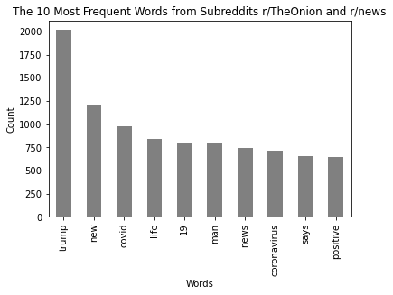
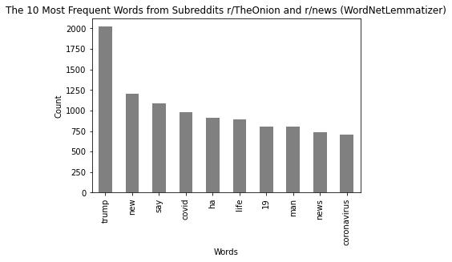
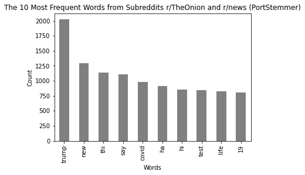
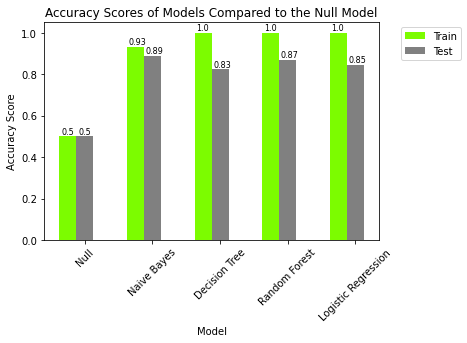
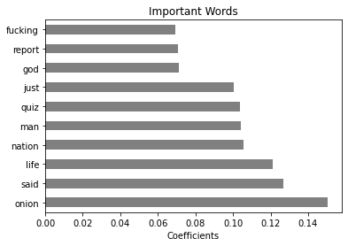
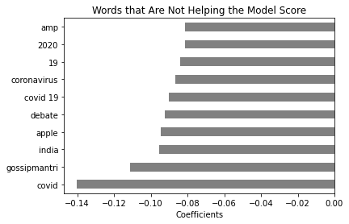

# Subreddits Classification Project

## Executive Summary:
1. **Problem Statement**:

We have two subreddits: r/news and r/TheOnion. The Onion is a satirical 'news' media. Would a computer model be able to predict the difference between these two subreddits? Would the model be able to predict the subreddit origin based on the text in the posts with high accuracy?

2. **Descirption of data**:

- Data was collected from two subreddits: [r/rews](https://www.reddit.com/r/news/) and [The Onion](https://www.reddit.com/r/TheOnion/). The first one is a general news feed and the second one is a subreddit dedicated to the satirical news media, The Onion. 
- The subreddits were collected using the [Pushshift Reddit API](https://github.com/pushshift/api). I collected 15000 posts using a custom [script](./code/reddit_data_collection.py). This script collected 15000 posts from each subreddit from October 1, 2020 11:51:05 PM (GMT) and before. This combined dataset can be found [here](./data/onion_news.cvs). 
- The collected data were examined for missing data and found that 99+% of the posts were missing the actually post and only had titles. I combined the posts and the titles into one column to use in further analysis. The final cleaned dataframe can be found [here](./data/clean_reddits.csv), which contains the following data:


Feature|Type|Description
---|---|---
author|object/str|The author screen name
created_utc|int|The timestamp of the post in epoch time
permalink|object/str|The link to the post
subreddit|object/str|The subreddit name (news or TheOnion)
text|object/str|The title and content of post (99+% of the posts have only the title)

- The final cleaned dataset contains 29977 subreddits posts (14978 from The Onion and 15000 from news) with timestamp range:

Subreddit|Latest Post|Oldest Post
---|---|---
The Onion|Friday, October 2nd, 2020 5:38:19 PM (GMT)|Saturday, October 1st, 2016 12:49:57 AM (GMT)
news|Friday, October 2nd, 2020 5:56:43 PM (GMT)|Monday, September 28th, 2020 4:25:14 PM (GMT)

- `text` was used as a feature to make predictions of the `subreddit` target.

- The posts amonted about 32000 words total, so the it not necessarily a large set of data.
- During the exploration process, I compared the effect of lemmatization and stemming on the 10 most frequent words.





Both lemmatization and stemming changed the ranking slightly, so I would expect them to affect the final model when implemented. The most frequent words are not very surprising because of current events (mainly covid-related topics) are dominated both subreddits.


3. **Models and Model Performance**:

I tested four classification models:

- [Logistic Regression](./code/logistic_reg_subreddits_classification.ipynb)
- [Decision Tree](./code/tree_subreddits_classification.ipynb)
- [Random Forest](./code/forest_subreddits_classification.ipynb)
- [Naive Bayes (Multinomial)](./code/nb_subreddits_classification.ipynb)

Using the default settings from each model in SciKit-Learn. When compared all models to the baseline.
As seen the figure below, the accuracy scores are higher than the baseline score of 50% for all models. This is true for both the training and testing set.


I fine-tuned the logistic regressor and the polynomial naive Bayes models in hopes of increasing the accuracy score. I picked these two models for their overall performance with default parameters and their ease of training.
I tried implementing the following natural language processes and hyperparameters:
- CountVectorizer
    * n_grams
    * max_features
    * min_df
    * max_df
- TfidfVectorizer
    * n_grams
    * max_features
    * min_df
    * max_df
- PortStemmer with CountVectorizer
- WordNetLemmatizer with CountVectorizer
- LogisticRegressor
    * regulatory hyperparameter C
- Multinomialnb
    * regulatory hyperparameter alpha
    
These are the summaries for the results:
* CounterVectorizer and TfidVectorizer performed similarly with both models.
* Lemmatazing or stemming made no difference to the performance of the models (it lowered slightly in some cases).
The best performing models (and hyperparameters) based on accuracy scores are:
- LogisticRegressor with:
    * CountVectorizer: max_df = 0.2, min_df = 2, max_features = 20000, ngram_range = (1, 2)
    * Hyperparameter: C = 0.001
This model reached 89.8% accuracy
- MultinomialNB with:
    * TfidfVectorizer: max_df = 0.4, min_df =2, max_features = 15000, ngram_range(1, 2)
    * Hyperparameter: alphae = 0.1

When looking at the words that contributed to the performance of the logistic regression model, many of them made sense such as the expletive and 'onion' that would not be present (or very little) in real news articles. There are many other words such as 'said' that seem odd or hard to explain why they are important in separating the two subreddits.



Similarly, words that were the least important in their contribution to the logistic regression model, some words were not surprising, such as 'covid' or '2020' because they are topics that often mentioned in both subreddits. There are some words, such as 'apple' and 'india' that seem odd and would be worthwhile exploring for their existance in the subreddits.



4. **Conclusions**:

The model is able to differentiate between the subreddits r/TheOnion and r/news with high accuracy of almost 90%. There are words that are important that are intiutive to understand the reason behind the contribution to the model, but others are not clear and are worth exploring further. It is surprising to see a high accuracy prediction between these two subreddits since generally sarcasm or satire is hard to pick in texts by models. However, there are also other differences that are lying under the surface that I did explore.

5. **Future Steps**:

My best model achieved a relatively high accuracy predicting the subreddit. However, there is room for improvement. There are more data cleaning such removing various numbers (a series of zeros, for example) that I would want to do to perhaps improve the model's performance. I would also try neural net models to improve the accuracy.  

## Directory Structure

```
project-3-master
|__ code
|   |__ reddit_data_collection.py   
|   |__ reddit_cleaning.ipynb
|   |__ nb_subreddits_classification.ipynb
|   |__ tree_subreddits_classification.ipynb  
|   |__ forest_subreddits_classification.ipynb
|   |__ logistic_reg_subreddits_classification.ipynb  
|   |__ models_comparison.ipynb 
|   |
|__ data
|   |__ clean_reddits.csv
|   |__ model_scores.csv
|   |__ onion_news.csv
|   |
|__ figures
|   |__ countvectorizer_10_most_frequent_words.png
|   |__ lem_10_most_frequent_words.png
|   |__ logr_important_words.png
|   |__ logr_not_important_words.png
|   |__ model_scores.png
|   |__ nb_important_words.png
|   |__ nb_not_important_words.png
|   |__ stem_10_most_frequent_words.png
|__ subreddits_presentation.pdf
|__ README.md
|__ background
    |__ README.md (original project description)
```